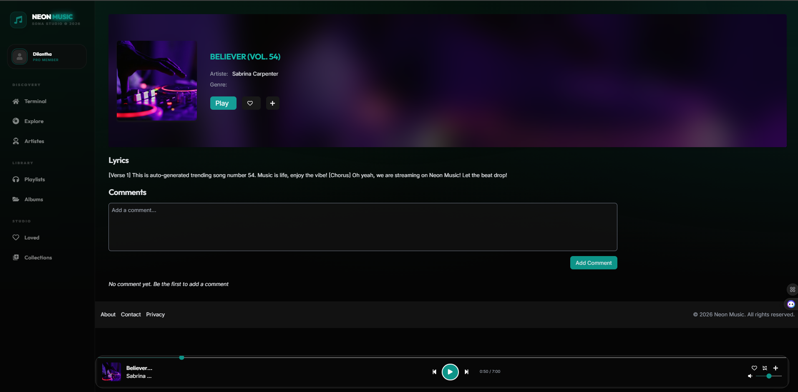
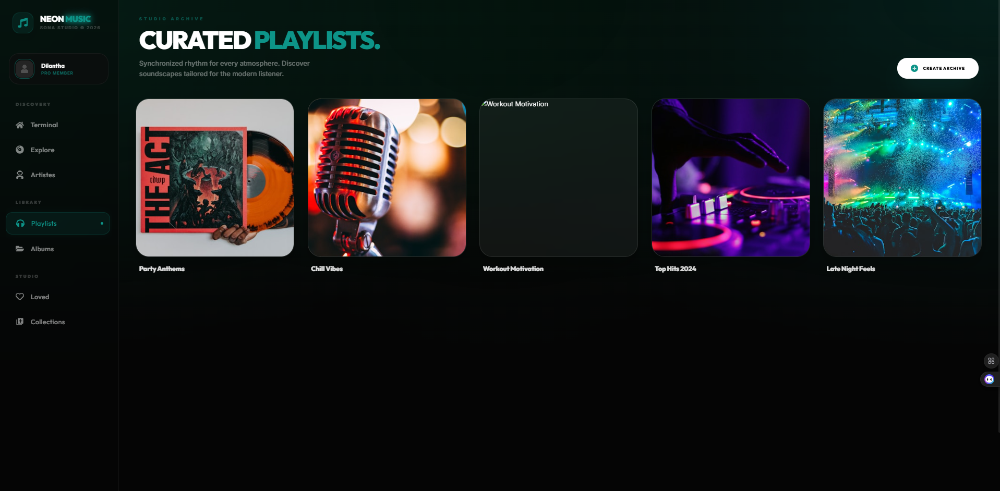
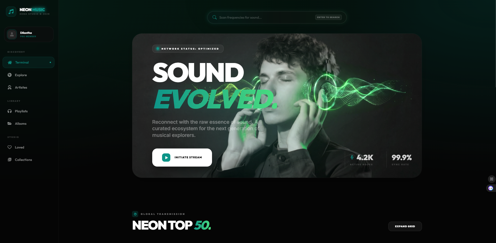

# ⚡ NEON MUSIC | SOUND EVOLVED

Experience the next generation of musical immersion. **Neon Music** is a high-performance, cinematic MERN-stack streaming platform designed for the digital explorer. Built with a futuristic aesthetic and a focus on raw auditory essence, it redefines how you interact with sound.



## 🌌 The Vision

Neon Music isn't just a player; it's a **curated ecosystem**. Utilizing a cutting-edge "Green-Theme" modernization, the platform features glassmorphic interfaces, 3D-inspired scroll aesthetics, and a dynamic "Grid" network status.

---

## 🚀 Core Features

- **⚡ High-Fidelity Streaming**: Seamless, low-latency audio transmission optimized for the desktop and mobile grid.
- **🎨 Cinematic UI/UX**: Ultra-modern aesthetic featuring immersive radial gradients, glassmorphism, and smooth Framer Motion transitions.
- **🧬 The Grid Expansion**: Advanced exploration of Artistes, Albums, and Playlists with deep metadata integration.
- **🛡️ Secure Persistence**: Robust authentication system with Redux-Persist integration for a seamless "always-on" experience.
- **🔥 Dynamic Rankings**: Real-time "Neon Top 50" global transmissions showcasing the most trending nodes in the ecosystem.
- **💬 Interactive Nodes**: Engage with the community through song commentary and collaborative interaction.

---

## 🛠️ Tech Stack

### Frontend (The Interface)

- **React 18 & Vite**: Lightning-fast development and optimized production builds.
- **Redux Toolkit & RTK Query**: Enterprise-grade state management and efficient data fetching.
- **Framer Motion**: Smooth, cinematic animations and micro-interactions.
- **Tailwind CSS & Vanilla CSS**: A blend of utility-first flexibility and bespoke high-end styling.
- **React Helmet Async**: Optimized SEO and dynamic metadata for every route.

### Backend (The Core)

- **Node.js & Express**: High-concurrency server architecture.
- **MongoDB & Mongoose**: Scalable, document-oriented data persistence.
- **Cloudinary / Multer**: Secure and optimized media storage and processing.
- **JWT & Bcrypt**: Industry-standard security and authentication.

---

## 🛰️ Getting Started

### 1. Clone the Transmission

```bash
git clone https://github.com/Dilantha2001/MusicApplication.git
cd MusicApplication
```

### 2. Configure Environment

**Server Configuration (`/server/.env`):**

```env
PORT = 4000
DB_STRING = your_mongodb_connection_string
JWT_SECRET = your_jwt_secret
CLOUD_NAME = your_cloudinary_name
API_KEY = your_cloudinary_key
API_SECRET = your_cloudinary_secret
```

**Client Configuration (`/client/.env`):**

```env
VITE_NeonMusic_BACKEND = http://localhost:4000
```

### 3. Initialize Nodes

**Backend Initiation:**

```bash
cd server
npm install
npm run dev
```

**Frontend Initiation:**

```bash
cd client
npm install
npm run dev
```

Visit `http://localhost:5173` to initiate your stream.

---

## 📸 Snapshots of the Grid





---

## 📝 Contribution

Join the grid and help us evolve the sound.

1. **Fork** the repository.
2. Create your **Feature Branch** (`git checkout -b feature/Evolution`).
3. **Commit** your changes.
4. **Push** to the branch.
5. Open a **Pull Request**.

---

Developed with ⚡ Dilantha Ranaweera.
